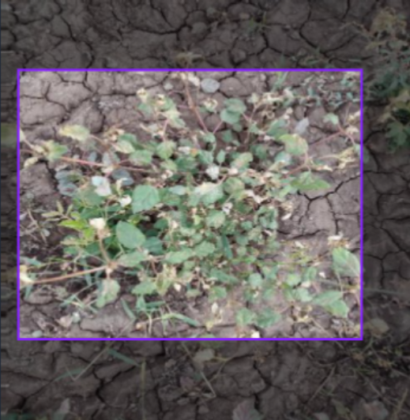
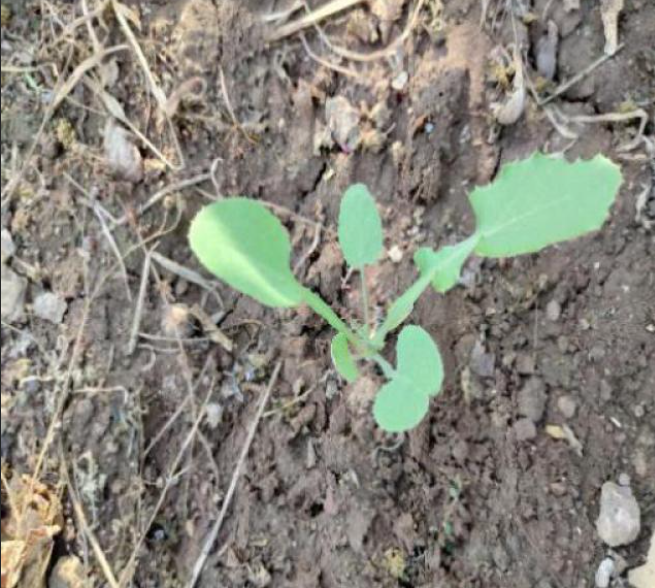
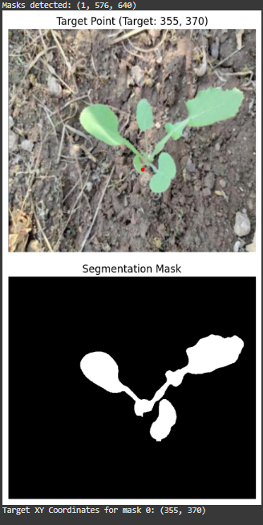
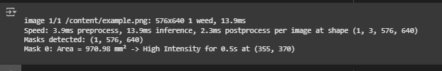
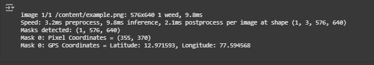

# 🌾 Smart Weed Detection & Laser Elimination System (India-Centric)

## 🔍 Overview

This project aims to assist Indian farmers with weed removal using a low-cost AI-powered mobile robot. The bot uses computer vision (YOLOv8 segmentation) to identify weeds in crop fields and targets them with a laser module—ensuring eco-friendly, precision-based weed elimination.

> 👨‍🌾 Built for Indian farms using a local dataset, affordable hardware, and deep learning.

---
---

## 🖼️ Sample Image Flow

### ▶️ Input to SAM
**Input Image:**


**Output Mask (SAM):**


---

### 🎯 YOLOv8 Segmentation
**Input Image:**


**YOLO Output :**





---

🗂️ All images are located in the `images/` folder.


## 📦 Repository Structure

| Folder | Description |
|--------|-------------|
| `notebooks/` | Colab notebooks for annotation (SAM) and training (YOLOv8) |
| `dataset/` | Contains annotated images: 200 train, 130 valid, 200 test |
| `arduino-hardware/` | Arduino & ESP32 code for controlling the laser and chassis |
| `software-ui/` | Web App plugin |
| `requirements.txt` | Python dependencies for YOLOv8 & SAM |
| `README.md` | You’re here! |

---

## 🧠 Computer Vision Pipeline

1. Used the [Crop and Weed Dataset (IIIT Kancheepuram)](https://universe.roboflow.com/indian-institute-of-information-technology-kancheepuram/crop-and-weed-project/dataset/1)
2. Annotated 530 images using Segment Anything Model (SAM):
   - 200 from `train`
   - 130 from `valid`
   - 200 from `test`
3. Trained YOLOv8-segmentation on patches of weed vs crop
4. Output per detection:
   - Weed segmentation mask
   - Area in mm² (for laser calibration)
   - X,Y coordinate of the laser focus point (marked red)
   - Recommendation for laser intensity and duration
   - Geo coordinates output

---

## 🧰 Hardware Used

| Component | Description |
|----------|-------------|
| Arduino UNO + ESP32 | Dual control system (ESP = logic, Arduino = action) |
| Servo Motor | Rotates laser turret to aim |
| Laser Module | Fires based on weed size |
| Chassis & Motors | Moves the bot through the field |
| Ultrasonic Sensor | Height/obstacle sensing |

—

## 💡 Unique Features

- Dataset is India-specific (not generalized global weeds)
- Polygonal mask detection (YOLOv8 segmentation) → accurate target zone
- MM²-based weed area → adaptive laser intensity
- Designed for on-ground chassis (cheaper than drone)
- Extendable with UI & GPS mapping

## 📦 Run Locally

To run notebooks:

```bash
pip install -r requirements.txt
